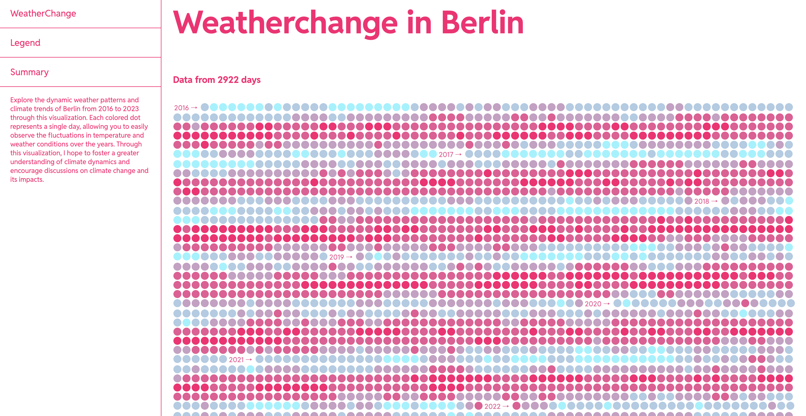

# Weather change in Berlin

Explore the dynamic weather patterns and climate trends of Berlin from 2016 to 2023 through this visualization. Each colored dot represents a single day, allowing you to easily observe the fluctuations in temperature and weather conditions over the years.

## Technologies

- React
- Next.js
- Typescript
- Open Meteo API

## To do

- Cleanup code formatting
- Include hovereffect for each day to display temperature and date
