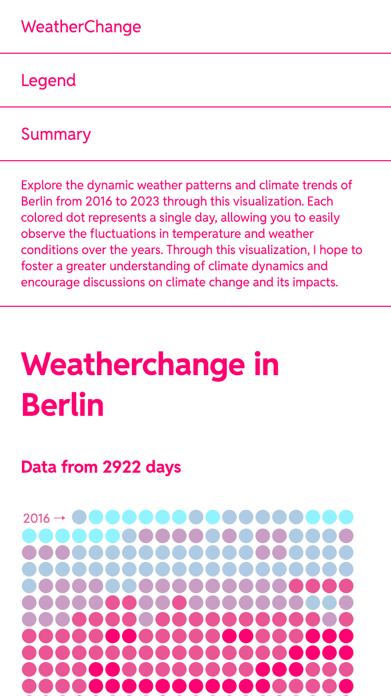

# Weather change in Berlin

Explore the dynamic weather patterns and climate trends of Berlin from 2016 to 2023 through this visualization. Each colored dot represents a single day, allowing you to easily observe the fluctuations in temperature and weather conditions over the years.

## Screens




## Technologies

- React
- Next.js
- Typescript
- Open Meteo API

## Getting Started

First, run the development server:

```bash
npm run dev
```
